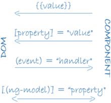

# Setup
```shell script
ng new ng-refresher #no routing, select CSS style
cd ng-refresher
ng serve
ng build #production build
```

# File structure
- ```angular.json```: Used by angular-cli.
- ```src/main.ts```: Entry point into app.
    ```ts
    platformBrowserDynamic().bootstrapModule(AppModule)
      .catch(err => console.error(err));
    ```
  Bootstraps the app module.
- ```src/app/app.module.ts```: Imports components and modules into an angular project.
    ```ts
    import { BrowserModule } from '@angular/platform-browser';
    import { NgModule } from '@angular/core';
    
    import { AppComponent } from './app.component';
    @NgModule({ //decorator to initialize exported AppModule
      declarations: [ //components to be used
        AppComponent
      ],
      imports: [ //modules to be imported
        BrowserModule
      ],
      providers: [],
      bootstrap: [AppComponent] //AppComponent launched on bootstrap
    })
    export class AppModule { }
    ```
  1. **Modules**: Add new functionality to angular apps.
  2. **Components**: Reusable parts of angular.

- **AppComponent** (```src/app/app.component.ts```)
    ```ts
    import { Component } from '@angular/core';
    
    @Component({
      selector: 'app-root', //by convention selectors names begin with 'app-'
      templateUrl: './app.component.html',
      styleUrls: ['./app.component.css']
    })
    export class AppComponent {
      title = 'ng-refresher';
    }
    ```
    1. **selector**: HTML tag through which this component will be called, i.e. ```<app-root>```. This is used in ```index.html```.
    2. **templateUrl**: HTML to be rendered by component.
    3. **styleUrls**: Stylesheets for styling. Styles are scoped for each component.

# Creating components
```
import { Component } from '@angular/core';
```
Create ```persons``` folder in ```app```. Create ```component.ts``` and ```component.html```. Import ```PersonsComponent``` in declarations for ```app.module.ts```. Now PersonComponent's selector can be used in AppCompoent's template.

app.component.html
```html
<app-persons></app-persons>
```

# Cross component communication
## 1. Property binding
Used to send data from component to its template or a child component. It uses ```[]``` symbol.

We want to use persons array from ```AppComponent``` in ```PersonsComponent```.
```ts
export class AppComponent {
  persons: string[] = ['Max', 'Manuel', 'Anna'];
}
```

1. Create ```personsList``` variable in PersonsComponent. Attach ```@input``` decorator to this variable. This allows it to accept values from other components.
```ts
import { Component, Input } from '@angular/core';

@Component({
    selector: 'app-persons',
    templateUrl: './persons.component.html'
})
export class PersonsComponent {
    @Input() personList: string[];
}
```

2. **Property binding**: In AppComponent's template, bind ```persons[]``` to ```personList[]``` using the following syntax:
```html
<app-persons [personList]="persons"></app-persons>
```
Property binding can also be used to pass typescript expressions and component parameters into HTML selectors. Eg.
```html
<input type="text" id="name" [value]="1+1">
```

3. **String interpolation**: It is a special syntax using double curly braces ```{{ }}``` to insert dynamic data into templates.
```html
<p>{{ personList }}</p>
```

4. **'ngLoop' directive**: Used to loop through list elements in angular templates. This directive becomes accessable by importing ```BrowserModule```in AppModule.
```html
<ul>
    <li *ngFor="let person of personList">{{ person }}</li>
</ul>
```

## 2. Event binding
To send data from template to component. It uses round braces ```()```:

**Syntax:**
```
<selector (event)="handler()">
```

1. To call PersonInputComponent's ```onCreateUser``` function when a button is clicked
```html
<button (click)="onCreateUser()">
```

2. **Local references**: Used to pass selector data from template to component using property binding. Local references are preceded by ```#``` sign.
```html
<input type="text" id="name" #personNameElement>
<button (click)="onCreateUser(personNameElement.value)">create user</button>
```

## 3. Two-way binding
Implemented by importing ```FormsModule``` from ```@angular/forms```. It allows two way data flow between component and template. This removes need of using local references or passing parameters into event bound functions.
```html
<input type="text" id="text" [(ngModel)]="enteredPersonName">
<button (click)="onClickUser()">Create user</button>
```

# Custom events
**Event binding** can be used to pass data back from a child component to its parent component. This is done by emitting a custom event which is heard by the parent.
For example, to notify app component about user creation event:

**PersonInputComponent**
```ts
    @Output() personCreate = new EventEmitter();
    enteredPersonName: string = '';

    onCreateUser() {
        console.log(this.enteredPersonName);
        this.personCreate.emit(this.enteredPersonName); //fires off event
        this.enteredPersonName = '';
    }
```
**AppComponent template**
```html
<app-person-input (personCreate)="onPersonCreated($event)">
```
Here ```$event``` is a keyword to intercept events in templates. But in the component we can directly accept the value contained in the event.

**AppComponent**
```ts
export class AppComponent {
  persons: string[] = ['Max', 'Manuel', 'Anna'];
  onPersonCreated(name: string): void {
    console.log('Passed' + name);
    this.persons.push(name);
  }
}
```

# Glossary
1. **Views**: Made up of **components** and **templates**.
2. **Data binding**: Used to exchange data between components and templates.

  1. **Property binding**: From component to its template or to a child component.
  2. **String interpolation**: To directly display component's string value in template.
  3. **Event binding**: From template to component or from child component to parent component.
  4. **Two way binding**