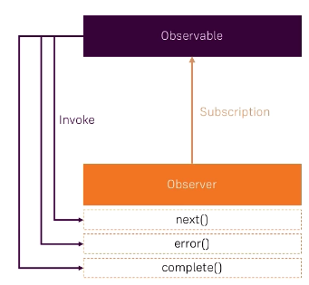
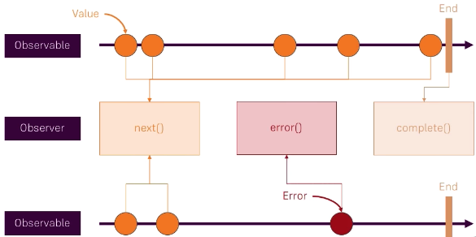

# Intro(1.intro.html)
- RxJS is a library for **reactive programming** using **observables**. It makes writing **asynchronous or callback based code** easier.
- RxJS provides multiple functions to **process observables in a funnel like manner**. The resulting code is more idiomatic than code written in vanilla Javascript.
```js
var button = document.querySelector('button');

button.addEventListener('click', (event) => { console.log(event) });//vanilla

Rx.Observable.fromEvent(button, 'click')
.throttleTime(1000)
.map (
    (event) => event.screenX
)
.subscribe (
    (coordinate) => { console.log(coordinate) }
);
```
# Observable, observer and subscription

## Observable
- Observable is a wrapper around a data source. This data source is generally a stream.

### Custom observables using create()
```js
Rx.Observable.create((observable) => {
    observable.next('value 1')
    // observable.error('error') //observable stops when error encountered
    setTimeout(() => { observable.complete() }, 2000);
    observable.next('value 2')

    button.onclick = function(event) {
        observer.next(event)
    }
}).subscribe(observer)
```
## Observer
- It observes the observable and performs some actions when:
    1. **next()**: New data is returned.
    2. **error()**: Error encountered. Observable shuts down after error is encountered. But complete() does not get called.
    3. **complete()**: Job done. But some observables like clicklistener never finish


```js
const observer = {
    next: function(value) {
        console.log(value)
    },
    error: function(error) {
        console.log(error)
    },
    complete: function() {
        
    }
}
Rx.Observable.fromEvent(button, click)
    .subscribe(observer)
```
## Subscription
- Observer listens to an observable through a **subscription**.
- To prevent memory leaks unsubscribe from an observer when work is done.
```js
subscription.unsubscribe()
```

# RxJS operators(2.operations.html)
# map() and throttleTime()
- **map()** Transforms incoming observable and returns a new observable.
- **throttleTime()**: Throttles rate of incoming values.
```js
let observable = Rx.Observable.interval(1000)//atomic counter event

let observer = {
    next: (value) => console.log(value)
}
observable
    .map((value) => { return value*2 }) //transform observable
    .throttleTime(2000) //set throttling
    .subscribe(observer)
```

## filter()
Filters events from reaching observer based on some condition.
```js
observable
    .filter((value) => { return value%2 == 0 }) //condition must be true
    .subscribe(observer)
```

## debounceTime()
Checks for pause in event emission.
```js
let input = document.querySelector('input')
let observable = Rx.Observable.fromEvent(input, 'input')

let observer = {
    next: (value) => console.log(value)
}

observable
.map((event) => event.target.value)
.distinctUntilChanged() //same values not sent
.subscribe(observer)
```

## distinctUntilChanged()
Makes sure that consecutive elements have different values.
```js
let input = document.querySelector('input')
let observable = Rx.Observable.fromEvent(input, 'input')

let observer = {
    next: (value) => console.log(value)
}

observable
.map((event) => event.target.value)
.debounceTime(500) //allow event only if 2 second gap after last event
.distinctUntilChanged() //same values not sent
.subscribe(observer)
```

## reduce()
- Performs addition or any other operation on event elements and returns the accumulator.
- Unsuitable for endless streams
```js
let observable = Rx.Observable.of(1,2,3,4)
let observer = {
    next: (value) => console.log(value)
}
observable
.reduce(//gives single end value
    (accumulator, current) => {
        return accumulator + current
}, 0)
.subscribe(observer)
```

## scan()
Similar to reduce() but returns all intermediary events as well
```js
let observable = Rx.Observable.of(1,2,3,4)
let observer = {
    next: (value) => console.log(value)
}
observable
.scan(//gives all intermediary values
    (accumulator, current) => {
        return accumulator + current
}, 0)
.subscribe(observer)
```

## pluck()
- Simplifies field extraction. It only works for objects
- Can accept multiple fields
```js
map((event) => event.target.value)

pluck('target', 'value') //pluck() simplifies field extraction
```
## mergeMap() (4.mergemap.html)
- Merge two observables into one observer.
- Merges an outer observable with an inner observable. Inner observable must emit event after outer observable has done this in order for mergeMap() to emit a merged event.
```js
let input1 = document.querySelector('#input1')
let input2 = document.querySelector('#input2')
let span = document.querySelector('span')

let observable1 = Rx.Observable.fromEvent(input1, 'input')
let observable2 = Rx.Observable.fromEvent(input2, 'input')

observable1.mergeMap(
    event1 => {//outer event must happen first
        return observable2.map(
            event2 => {//
                return event1.target.value + ' ' + event2.target.value
            }
        )
    }
).subscribe({
    next: (event) => {
        console.log(event)
        return span.textContent = event
    }
})
```

## switchMap()
- Cancels existing subscription(switch) and starts a new one(map).
```js
button = document.querySelector('button')
let observable1 = Rx.Observable.fromEvent(button, 'click')
let observable2 = Rx.Observable.interval(1000)

observer = {
    next: (value) => console.log(value)
}
observable1
.switchMap(//counter starts all over again
    event => { return observable2 }
)
.subscribe(observer)
```

# RxJS 6
- RxJS operators are now functions instead of methods:
    1. **Function**: standalone
    2. **Method**: An object's function
This has changed import statement structure and names of many operations.
- **pipe()**: ```map()```, ```throttleTime()``` are not chained but are passed as parameters to ```pipe()```.
```js
.pipe(
    map((value) => { return value*2 })
)
```

# Subjects(3.subjects.html)
- Observables are passive. RxJS subjects are similar to observables but can be also triggered programmatically.
- They're like event listeners of angular.
```js
            let subject = new Rx.Subject()
            let observer = {
                next: (value) => console.log(value),
                error: (error) => console.log(error),
                complete: () => console.log('complete')
            }
            subject.subscribe(observer)
            subject.next('next')
            // subject.error('error')
            subject.next('next 2')
            subject.complete()
```
